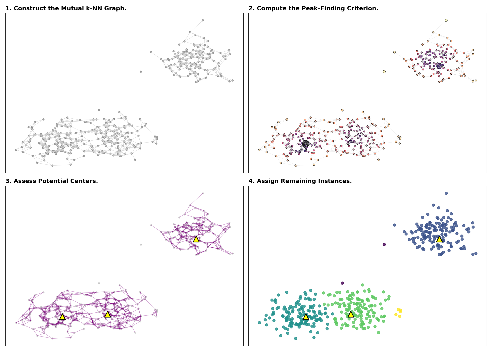

# fastCPF

Fast Component-wise Peak-Finding (CPF) clustering in Rust with Python bindings.

Official Implementation Repository: [CPFcluster](https://github.com/tobinjo96/CPFcluster)

Original Paper: [A Theoretical Analysis of Density Peaks Clustering and the Component-wise Peak-Finding Algorithm](https://www.tara.tcd.ie/items/bbde36f5-a6e4-4f26-b611-f16aff652732) (Tobin & Zhang, IEEE TPAMI 2024)



## Installation

### pip

```bash
pip install fastcpf
```

### uv (from source)

```bash
git clone https://github.com/yuki-inaho/fastCPF.git
cd fastCPF
uv sync --all-extras
```

### From GitHub (requires Rust)

```bash
pip install 'fastcpf @ git+https://github.com/yuki-inaho/fastCPF'
```

### From Release Assets (pre-built wheels)

```bash
# Download a wheel matching your Python and platform from GitHub Releases
pip install https://github.com/yuki-inaho/fastCPF/releases/download/v1.0.0/fastcpf-1.0.0-cp312-cp312-manylinux_2_28_x86_64.whl
```

## Usage

### Basic API

```python
from fastcpf import FastCPF
import numpy as np

X = np.random.randn(1000, 2).astype(np.float32)

model = FastCPF(min_samples=10, rho=0.4)
model.fit(X)

print(f"Clusters: {model.n_clusters_}, Outliers: {model.n_outliers_}")
```

### Running Examples

```bash
# Basic clustering example
uv run python examples/basic_clustering.py

# 4-panel visualization (generates examples/fastcpf_viz.png)
uv run python examples/visualization.py

# Benchmark
uv run python examples/benchmark.py
```

## Parameters

- `min_samples`: k-NN neighbors (default: 10)
- `rho`: Density scale (default: 0.4)
- `alpha`: Edge cutoff (default: 1.0)
- `cutoff`: Outlier threshold (default: 1)
- `knn_backend`: "kd" or "brute" (default: "kd")

## Attributes

- `labels_`: Cluster labels (-1 = outlier)
- `n_clusters_`: Number of clusters
- `n_outliers_`: Number of outliers
- `knn_radius_`, `big_brother_`, `peak_score_`: Intermediate results
